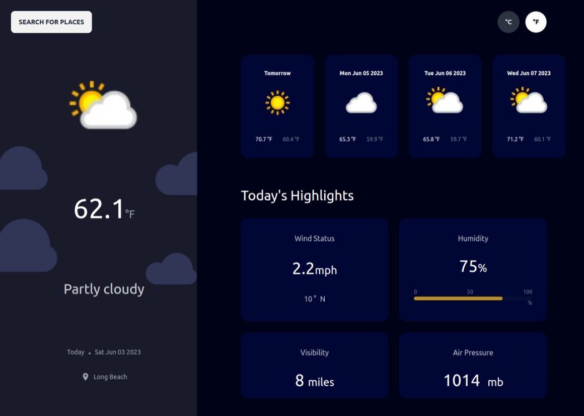
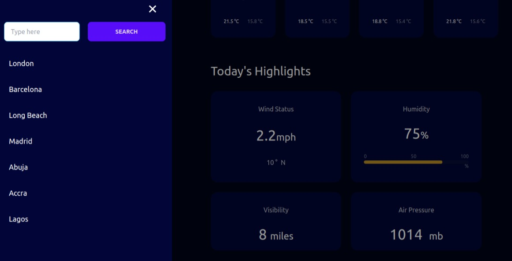

# Weather Application

A Vue.js application that allows users to get the weather condition of any location of their choice, including their current location. Users can also view the weather forecast for their chosen location for the next five days. The application utilizes weather data from a weather API to provide accurate and up-to-date information.

## Live Link
[Weather App](https://kingstoncodes-weather-app.netlify.app/)

## Technologies Used
- Vue.js
- Weather API

## Installation
1. Clone the repository: `git clone https://github.com/Ericwiz/weather-app`
2. Navigate to the project directory: `cd weather-app`
3. Install dependencies: `npm install`

## Usage
1. Start the application: `npm run dev`
2. Open your web browser and access the application at `http://localhost:5173`.
<!-- 3. Enter the desired location in the search field or click on the map to select your current location. -->
3. View the current weather conditions, including temperature, humidity, wind speed, and more.
4. Navigate to the forecast section to see the weather forecast for the next five days.
5. Customize the temperature unit (Celsius or Fahrenheit) using the toggle button.
<!-- 6. Explore additional features and information provided by the application. -->

## Screenshots

## Features
- Current weather display for the selected location.
- Weather forecast for the next five days.
- Customizable temperature unit (Celsius or Fahrenheit).
- Interactive map for selecting the current location. (coming soon)
- Additional weather details such as humidity, wind speed, and more.

## API Integration
The application integrates with a weather API to fetch weather data for the selected location. It utilizes API endpoints to retrieve current weather conditions and forecast information.

## Challenges Faced
During the development process, some challenges were encountered in handling API responses and data manipulation. However, with proper error handling and data parsing techniques, these challenges were successfully addressed.

## Future Enhancements
- Implement a user authentication system to provide personalized weather information.
- Add a feature to save favorite locations for quick access to weather information.
- Integrate with google map so that users can easily enter any location of their choice
- Include additional weather parameters such as precipitation, UV index, and air quality.
- Enhance the user interface with more interactive and visually appealing elements.

## Acknowledgments
- The Vue.js documentation and community for providing valuable resources.
- The weather API for providing accurate and reliable weather data.

## License
<!-- This project is licensed under the MIT License. See the [LICENSE](LICENSE) file for more details. -->

## Contact Information
For any questions or feedback, please reach out to [wisdomagu44@gmail.com](wisdomagu44@gmailcom).

## References
- [Vue.js documentation](https://vuejs.org/guide/introduction.html)
- [Weather API documentation](https://www.weatherapi.com/docs/)
